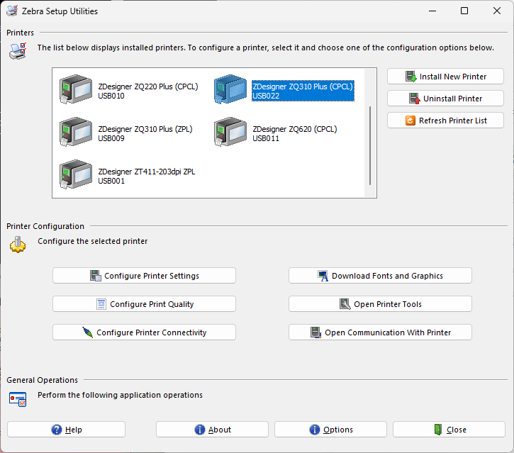
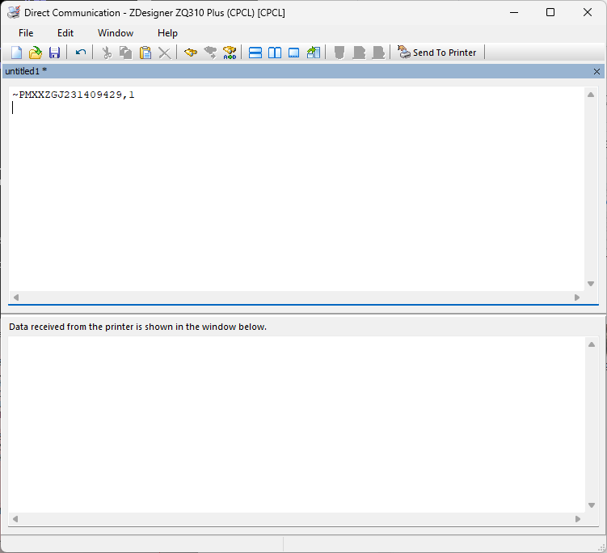

### Link-OS プリンタを工場出荷状態に戻す方法

プリンタを工場出荷状態に戻したい。わかります。納品前や検証前にプリンタを初期化する方法を説明します。

#### 初期化方法

1. Link-OSプリンタとPCをUSBケーブルで接続する。
1. Zebra Setup for Windows を起動する。
1. Printers にて、接続中のプリンタを選択する。

  

1. [Open Communication with Printer]を選択する。
1. 初期化コマンドを入力する。  

    a. プリンタの設定のみ初期化し、内蔵ドライブ（E Driver)のファイルは残す場合。

        ~PM[プリンタのシリアル番号],0

    b. プリンタの設定のみ初期化し、内蔵ドライブ（E Driver)のファイルも完全削除する場合。

        ~PM[プリンタのシリアル番号],1

    ▼ S/N XXZGJ231409429のコマンド例

    

1. [Send Printer]を選択する。
1. プリンタが１～２回再起動する。
1. 起動したら初期化完了。

